

<picture>
  <source media="(max-width: 700px)" srcset="./assets/profile-banner-m.jpg">
  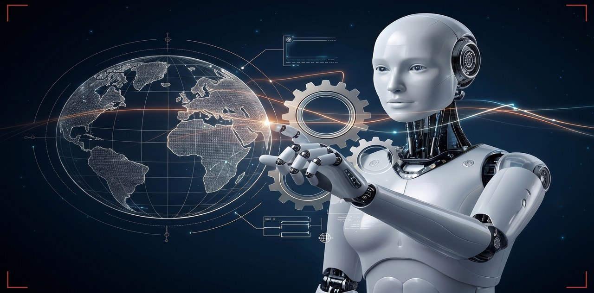
</picture>
<picture>
  <source media="(max-width: 700px) and (prefers-color-scheme: dark)" srcset="./assets/nameplate-m.svg">
  <source media="(max-width: 700px) and (prefers-color-scheme: light)" srcset="./assets/nameplate-m-light.svg">
  <source media="(prefers-color-scheme: dark)" srcset="./assets/nameplate.svg">
  <source media="(prefers-color-scheme: light)" srcset="./assets/nameplate-light.svg">
  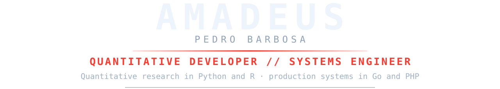
</picture>
<picture>
  <source media="(prefers-color-scheme: dark)" srcset="./assets/at-a-glance.svg">
  <source media="(prefers-color-scheme: light)" srcset="./assets/at-a-glance-light.svg">
  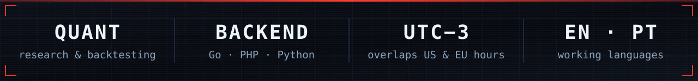
</picture>

  
  
  
  

<picture>
  <source media="(max-width: 700px) and (prefers-color-scheme: dark)" srcset="./assets/h-work-m.svg">
  <source media="(max-width: 700px) and (prefers-color-scheme: light)" srcset="./assets/h-work-m-light.svg">
  <source media="(prefers-color-scheme: dark)" srcset="./assets/h-work.svg">
  <source media="(prefers-color-scheme: light)" srcset="./assets/h-work-light.svg">
  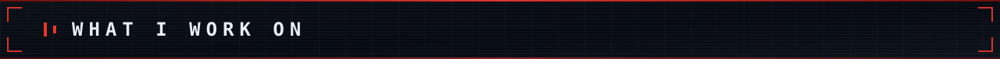
</picture>

<picture>
  <source media="(max-width: 700px) and (prefers-color-scheme: dark)" srcset="./assets/w-quant-m.svg">
  <source media="(max-width: 700px) and (prefers-color-scheme: light)" srcset="./assets/w-quant-m-light.svg">
  <source media="(prefers-color-scheme: dark)" srcset="./assets/w-quant.svg">
  <source media="(prefers-color-scheme: light)" srcset="./assets/w-quant-light.svg">
  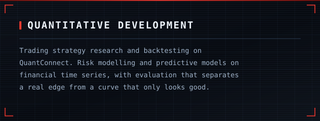
</picture>
<picture>
  <source media="(max-width: 700px) and (prefers-color-scheme: dark)" srcset="./assets/w-go-m.svg">
  <source media="(max-width: 700px) and (prefers-color-scheme: light)" srcset="./assets/w-go-m-light.svg">
  <source media="(prefers-color-scheme: dark)" srcset="./assets/w-go.svg">
  <source media="(prefers-color-scheme: light)" srcset="./assets/w-go-light.svg">
  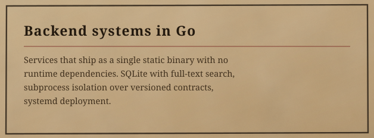
</picture>
<picture>
  <source media="(max-width: 700px) and (prefers-color-scheme: dark)" srcset="./assets/w-php-m.svg">
  <source media="(max-width: 700px) and (prefers-color-scheme: light)" srcset="./assets/w-php-m-light.svg">
  <source media="(prefers-color-scheme: dark)" srcset="./assets/w-php.svg">
  <source media="(prefers-color-scheme: light)" srcset="./assets/w-php-light.svg">
  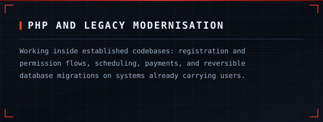
</picture>
<picture>
  <source media="(max-width: 700px) and (prefers-color-scheme: dark)" srcset="./assets/w-data-m.svg">
  <source media="(max-width: 700px) and (prefers-color-scheme: light)" srcset="./assets/w-data-m-light.svg">
  <source media="(prefers-color-scheme: dark)" srcset="./assets/w-data.svg">
  <source media="(prefers-color-scheme: light)" srcset="./assets/w-data-light.svg">
  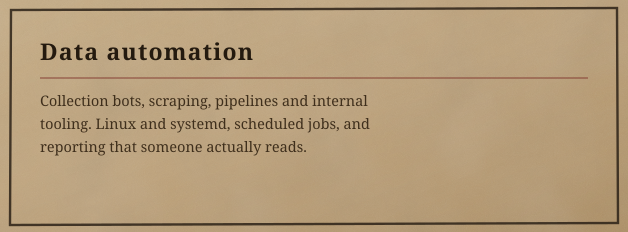
</picture>

> Most of what I build is private — client work, an employer's platform, and my own tooling. The public repositories below are the part I can show.

<picture>
  <source media="(max-width: 700px) and (prefers-color-scheme: dark)" srcset="./assets/h-selected-m.svg">
  <source media="(max-width: 700px) and (prefers-color-scheme: light)" srcset="./assets/h-selected-m-light.svg">
  <source media="(prefers-color-scheme: dark)" srcset="./assets/h-selected.svg">
  <source media="(prefers-color-scheme: light)" srcset="./assets/h-selected-light.svg">
  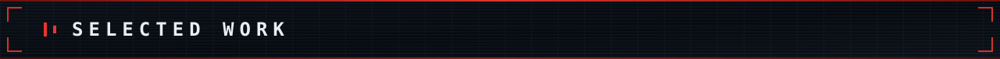
</picture>

**iode** — personal orchestration engine, in Go. Indexes projects, collects daily
activity and surfaces connections between them. Single static binary, SQLite with
FTS5, no CGO. Collectors run as subprocesses over a versioned JSON contract, so a
new data source never touches the core.

**Go suite** — `sentinel` for host integrity, `bounty` for ranking funded GitHub
issues, `rgbd`. One thesis across three programs: no CGO, one binary each,
deployed with systemd.

**[SOS](https://github.com/Amadeus-22/SOS)** — administrative system built end to
end, in JavaScript.

**Quantitative research** — strategy simulation and backtesting on
[QuantConnect](https://github.com/QuantConnect), with predictive modelling in
Python and R.

<picture>
  <source media="(max-width: 700px) and (prefers-color-scheme: dark)" srcset="./assets/h-currently-m.svg">
  <source media="(max-width: 700px) and (prefers-color-scheme: light)" srcset="./assets/h-currently-m-light.svg">
  <source media="(prefers-color-scheme: dark)" srcset="./assets/h-currently.svg">
  <source media="(prefers-color-scheme: light)" srcset="./assets/h-currently-light.svg">
  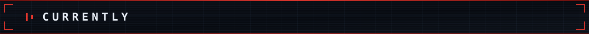
</picture>

**Software Engineer at [TIIX](https://github.com/AM-TIIX)** — a health and services
platform ([tiix.com.br](https://tiix.com.br/)). I work on the PHP portals for
clients, professionals and brokers: registration and permission flows, scheduling,
payments, and the shared foundation beneath them. Legacy PHP in a WordPress-based
ecosystem, with reversible MySQL migrations.

<picture>
  <source media="(max-width: 700px) and (prefers-color-scheme: dark)" srcset="./assets/h-stack-m.svg">
  <source media="(max-width: 700px) and (prefers-color-scheme: light)" srcset="./assets/h-stack-m-light.svg">
  <source media="(prefers-color-scheme: dark)" srcset="./assets/h-stack.svg">
  <source media="(prefers-color-scheme: light)" srcset="./assets/h-stack-light.svg">
  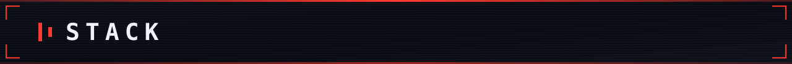
</picture>
<picture>
  <source media="(prefers-color-scheme: dark)" srcset="./assets/stack.svg">
  <source media="(prefers-color-scheme: light)" srcset="./assets/stack-light.svg">
  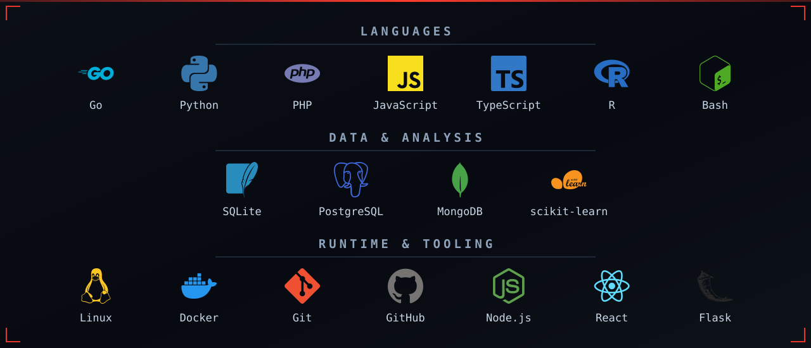
</picture>

<picture>
  <source media="(max-width: 700px) and (prefers-color-scheme: dark)" srcset="./assets/h-communities-m.svg">
  <source media="(max-width: 700px) and (prefers-color-scheme: light)" srcset="./assets/h-communities-m-light.svg">
  <source media="(prefers-color-scheme: dark)" srcset="./assets/h-communities.svg">
  <source media="(prefers-color-scheme: light)" srcset="./assets/h-communities-light.svg">
  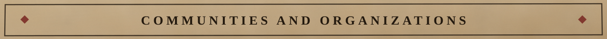
</picture>

<table>
<tr>
<td width="50%" valign="top">
  
  <h3><a href="https://github.com/QuantConnect">QuantConnect</a></h3>
  
Algorithmic trading research and backtesting, on the platform behind <a href="https://github.com/QuantConnect/Lean">Lean</a>.

</td>
<td width="50%" valign="top">
  
  <h3><a href="https://github.com/AM-TIIX">TIIX</a></h3>
  
Health and services platform (<a href="https://tiix.com.br/">tiix.com.br</a>). Current employer.

</td>
</tr>
<tr>
<td width="50%" valign="top">
  
  <h3><a href="https://github.com/NER-ELOHIM">NER-ELOHIM</a></h3>
  
My own organization, where the Go suite and the engineering tooling live. Private by design.

</td>
<td width="50%" valign="top">
  
  <h3><a href="https://github.com/instituto-nova-sos">Instituto Nova SOS</a></h3>
  
Contributor to <code>chesed</code>, a Go and TypeScript project for a social institute.

</td>
</tr>
</table>

<picture>
  <source media="(max-width: 700px) and (prefers-color-scheme: dark)" srcset="./assets/h-contact-m.svg">
  <source media="(max-width: 700px) and (prefers-color-scheme: light)" srcset="./assets/h-contact-m-light.svg">
  <source media="(prefers-color-scheme: dark)" srcset="./assets/h-contact.svg">
  <source media="(prefers-color-scheme: light)" srcset="./assets/h-contact-light.svg">
  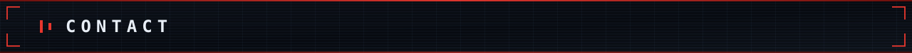
</picture>

  Open to <b>remote roles and contract work</b>: backend engineering,
  quantitative development and data automation.

  
  

