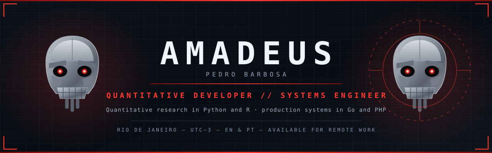

  

  
  
  
  

  I research trading strategies and build the systems that run them. 
  Quantitative work in <b>Python</b> and <b>R</b> · production software in <b>Go</b> and <b>PHP</b>.

<table align="center">
  <tr>
    <td align="center"><strong>Quant</strong> research &amp; backtesting</td>
    <td align="center"><strong>Backend</strong> Go · PHP · Python</td>
    <td align="center"><strong>UTC−3</strong> overlaps US &amp; EU hours</td>
    <td align="center"><strong>EN · PT</strong> working languages</td>
  </tr>
</table>

---

## What I work on

<table>
  <tr>
    <td width="50%" valign="top">
      <h3>Quantitative development</h3>
      
Trading strategy research and backtesting on QuantConnect. Risk modelling and predictive models on financial time series, with evaluation that separates a real edge from a curve that only looks good.

    </td>
    <td width="50%" valign="top">
      <h3>Backend systems in Go</h3>
      
Services that ship as a single static binary with no runtime dependencies. SQLite with full-text search, subprocess isolation over versioned contracts, systemd deployment.

    </td>
  </tr>
  <tr>
    <td width="50%" valign="top">
      <h3>PHP applications &amp; legacy modernisation</h3>
      
Working inside established codebases: registration and permission flows, scheduling, payments, and reversible database migrations on systems already carrying users.

    </td>
    <td width="50%" valign="top">
      <h3>Data automation</h3>
      
Collection bots, scraping, pipelines and internal tooling. Linux and systemd, scheduled jobs, and reporting that someone actually reads.

    </td>
  </tr>
</table>

> Most of what I build is private — client work, an employer's platform, and my own tooling. The public repositories below are the part I can show.

---

## Selected work

**[iode](https://github.com/Amadeus-22)** — personal orchestration engine, in Go.
Indexes projects, collects daily activity and surfaces connections between them.
Single static binary, SQLite with FTS5, no CGO. Collectors run as subprocesses
over a versioned JSON contract, so a new data source never touches the core.

**Go suite** — `sentinel` for host integrity, `bounty` for ranking funded GitHub
issues, `rgbd`. One thesis across three programs: no CGO, one binary each,
deployed with systemd.

**[SOS](https://github.com/Amadeus-22/SOS)** — administrative system built end to
end, in JavaScript. The project I point to when the question is whether I ship
whole systems, not only models.

**Quantitative research** — strategy simulation and backtesting on QuantConnect,
with predictive modelling in Python and R.

---

## Currently

**Software Engineer at [TIIX](https://tiix.com.br/)** — a health and services platform.

I work on the PHP portals for clients, professionals and brokers: registration
and permission flows, scheduling, payments, and the shared foundation beneath
them. Legacy PHP in a WordPress-based ecosystem, with reversible MySQL migrations.

---

## Stack

<b>LANGUAGES</b>

  

<b>DATA &amp; ANALYSIS</b>

  

<b>RUNTIME &amp; TOOLING</b>

  

---

## Communities & organizations

<table>
  <tr>
    <td width="50%" valign="top">
      <h3><a href="https://github.com/QuantConnect">QuantConnect</a></h3>
      
Algorithmic trading research and backtesting, on the platform behind <a href="https://github.com/QuantConnect/Lean">Lean</a>. Where the quantitative side of my work is developed and tested.

    </td>
    <td width="50%" valign="top">
      <h3><a href="https://github.com/AM-TIIX">TIIX</a></h3>
      
Health and services platform (<a href="https://tiix.com.br/">tiix.com.br</a>). Current employer — see <b>Currently</b> above.

    </td>
  </tr>
  <tr>
    <td width="50%" valign="top">
      <h3><a href="https://github.com/NER-ELOHIM">NER-ELOHIM</a></h3>
      
My own organization, where the Go suite and the engineering tooling live. Private by design.

    </td>
    <td width="50%" valign="top">
      <h3><a href="https://github.com/instituto-nova-sos">Instituto Nova SOS</a></h3>
      
Contributor to <code>chesed</code>, a Go and TypeScript project for a social institute.

    </td>
  </tr>
</table>

---

## Contact

  Open to <b>remote roles and contract work</b>: backend engineering,
  quantitative development and data automation.

  
  

