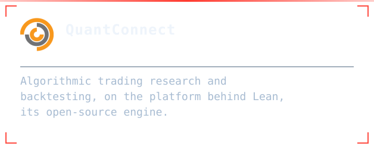
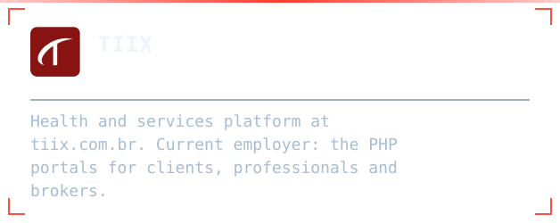
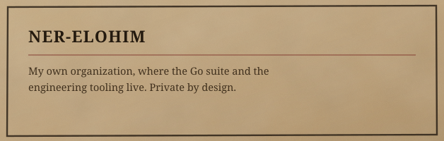
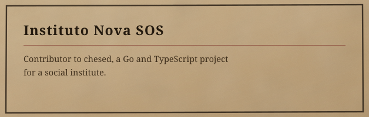

  
  

  
  
  
  

  

<table>
<tr>
<td width="50%"></td>
<td width="50%"></td>
</tr>
<tr>
<td width="50%"></td>
<td width="50%"></td>
</tr>
</table>

> Most of what I build is private — client work, an employer's platform, and my own tooling. The public repositories below are the part I can show.

  

**iode** — personal orchestration engine, in Go. Indexes projects, collects daily
activity and surfaces connections between them. Single static binary, SQLite with
FTS5, no CGO. Collectors run as subprocesses over a versioned JSON contract, so a
new data source never touches the core.

**Go suite** — `sentinel` for host integrity, `bounty` for ranking funded GitHub
issues, `rgbd`. One thesis across three programs: no CGO, one binary each,
deployed with systemd.

**[SOS](https://github.com/Amadeus-22/SOS)** — administrative system built end to
end, in JavaScript.

**Quantitative research** — strategy simulation and backtesting on
[QuantConnect](https://github.com/QuantConnect), with predictive modelling in
Python and R.

  

**Software Engineer at [TIIX](https://github.com/AM-TIIX)** — a health and services
platform ([tiix.com.br](https://tiix.com.br/)). I work on the PHP portals for
clients, professionals and brokers: registration and permission flows, scheduling,
payments, and the shared foundation beneath them. Legacy PHP in a WordPress-based
ecosystem, with reversible MySQL migrations.

  
  

  

<table>
<tr>
<td width="50%"></td>
<td width="50%"></td>
</tr>
<tr>
<td width="50%"></td>
<td width="50%"></td>
</tr>
</table>

  

  Open to <b>remote roles and contract work</b>: backend engineering,
  quantitative development and data automation.

  
  

