

<picture>
  <source media="(max-width: 700px)" srcset="./assets/profile-banner-m.jpg">
  
</picture>
<picture>
  <source media="(max-width: 700px) and (prefers-color-scheme: dark)" srcset="./assets/nameplate-m.svg">
  <source media="(max-width: 700px) and (prefers-color-scheme: light)" srcset="./assets/nameplate-m-light.svg">
  <source media="(prefers-color-scheme: dark)" srcset="./assets/nameplate.svg">
  <source media="(prefers-color-scheme: light)" srcset="./assets/nameplate-light.svg">
  
</picture>
<picture>
  <source media="(prefers-color-scheme: dark)" srcset="./assets/at-a-glance.svg">
  <source media="(prefers-color-scheme: light)" srcset="./assets/at-a-glance-light.svg">
  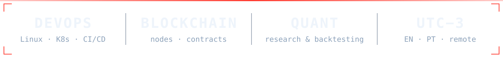
</picture>

  
  
  
  

<picture>
  <source media="(max-width: 700px) and (prefers-color-scheme: dark)" srcset="./assets/h-work-m.svg">
  <source media="(max-width: 700px) and (prefers-color-scheme: light)" srcset="./assets/h-work-m-light.svg">
  <source media="(prefers-color-scheme: dark)" srcset="./assets/h-work.svg">
  <source media="(prefers-color-scheme: light)" srcset="./assets/h-work-light.svg">
  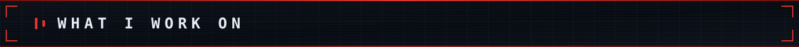
</picture>

<picture>
  <source media="(max-width: 700px) and (prefers-color-scheme: dark)" srcset="./assets/w-quant-m.svg">
  <source media="(max-width: 700px) and (prefers-color-scheme: light)" srcset="./assets/w-quant-m-light.svg">
  <source media="(prefers-color-scheme: dark)" srcset="./assets/w-quant.svg">
  <source media="(prefers-color-scheme: light)" srcset="./assets/w-quant-light.svg">
  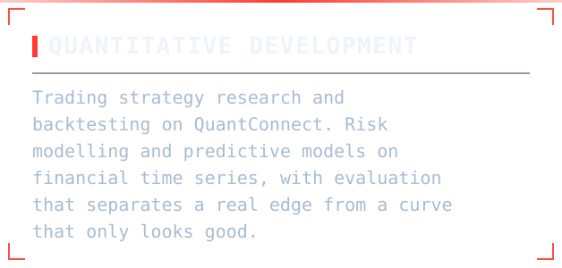
</picture>
<picture>
  <source media="(max-width: 700px) and (prefers-color-scheme: dark)" srcset="./assets/w-go-m.svg">
  <source media="(max-width: 700px) and (prefers-color-scheme: light)" srcset="./assets/w-go-m-light.svg">
  <source media="(prefers-color-scheme: dark)" srcset="./assets/w-go.svg">
  <source media="(prefers-color-scheme: light)" srcset="./assets/w-go-light.svg">
  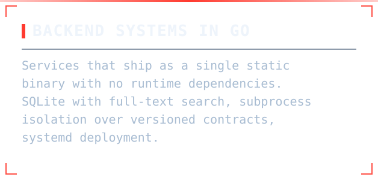
</picture>
<picture>
  <source media="(max-width: 700px) and (prefers-color-scheme: dark)" srcset="./assets/w-php-m.svg">
  <source media="(max-width: 700px) and (prefers-color-scheme: light)" srcset="./assets/w-php-m-light.svg">
  <source media="(prefers-color-scheme: dark)" srcset="./assets/w-php.svg">
  <source media="(prefers-color-scheme: light)" srcset="./assets/w-php-light.svg">
  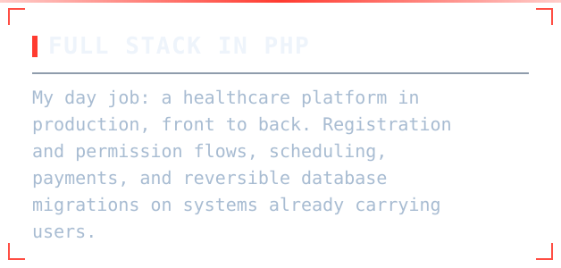
</picture>
<picture>
  <source media="(max-width: 700px) and (prefers-color-scheme: dark)" srcset="./assets/w-data-m.svg">
  <source media="(max-width: 700px) and (prefers-color-scheme: light)" srcset="./assets/w-data-m-light.svg">
  <source media="(prefers-color-scheme: dark)" srcset="./assets/w-data.svg">
  <source media="(prefers-color-scheme: light)" srcset="./assets/w-data-light.svg">
  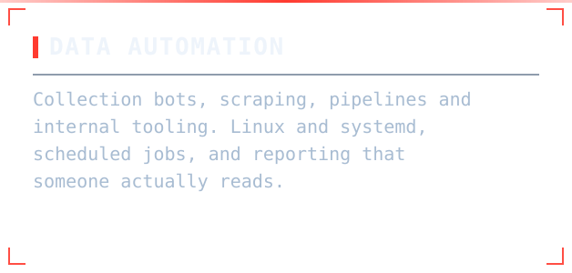
</picture>

> Every repository below is public, tested and green in CI. Client work and my own
> tooling (iode, sentinel) stay private.

<picture>
  <source media="(max-width: 700px) and (prefers-color-scheme: dark)" srcset="./assets/h-selected-m.svg">
  <source media="(max-width: 700px) and (prefers-color-scheme: light)" srcset="./assets/h-selected-m-light.svg">
  <source media="(prefers-color-scheme: dark)" srcset="./assets/h-selected.svg">
  <source media="(prefers-color-scheme: light)" srcset="./assets/h-selected-light.svg">
  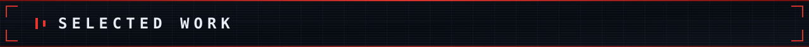
</picture>

**[tickguard](https://github.com/Amadeus-22/tickguard)** — validates live crypto
trade feeds (Binance, Kraken, Mercado Bitcoin), tells known gaps from silent ones,
writes clean QuantConnect LEAN data and audits existing LEAN datasets. Go.

**[rpcgate](https://github.com/Amadeus-22/rpcgate)** — resilient Ethereum JSON-RPC
gateway: failover, circuit breakers, routing by block height, safe caching and
per-provider metrics, proven with chaos tests. Go.

**[chainwatch](https://github.com/Amadeus-22/chainwatch)** — watches wallets for
risky ERC-20 approvals and drain patterns across EVM chains, reorg-safe, with
Sign-In with Ethereum and one-click revoke through MetaMask. Go, Solidity, React.

**[permwatch](https://github.com/Amadeus-22/permwatch)** — shows who can sign for a
KleverChain account, flags risky permissions and alerts by webhook or Telegram when
they change; also watches spending-limit vaults. Verified against testnet. Go.

**[klever-contracts](https://github.com/Amadeus-22/klever-contracts)** — smart
contracts for KleverChain: a KLV vault with a per-period spending limit, deployed
and exercised on testnet, with a toolchain setup that builds. Rust.

**[costbasis-br](https://github.com/Amadeus-22/costbasis-br)** — Brazilian crypto
cost basis with exact arithmetic; tax rules are dated, cited data instead of code. Go.

**[Editalis](https://github.com/Amadeus-22/editalis)** — WhatsApp alerts for
Brazilian public service exams, filtered by each subscriber's profile, with
billing and LGPD consent. Python, FastAPI.

**[bounty](https://github.com/NER-ELOHIM/bounty)** and
**[news](https://github.com/NER-ELOHIM/news)** — a GitHub bounty finder that
filters out bounty farms, and a curated weekly magazine. Go and PHP.

**Quantitative research** — strategy simulation and backtesting on
[QuantConnect](https://github.com/QuantConnect), with predictive modelling in
Python and R.

<picture>
  <source media="(max-width: 700px) and (prefers-color-scheme: dark)" srcset="./assets/h-oss-m.svg">
  <source media="(max-width: 700px) and (prefers-color-scheme: light)" srcset="./assets/h-oss-m-light.svg">
  <source media="(prefers-color-scheme: dark)" srcset="./assets/h-oss.svg">
  <source media="(prefers-color-scheme: light)" srcset="./assets/h-oss-light.svg">
  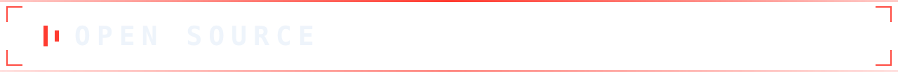
</picture>

- **QuantConnect Lean** — [Rachev Ratio indicator](https://github.com/QuantConnect/Lean/pull/9847) (C#)
- **QuantConnect lean-cli** — [original casing in invalid choice errors](https://github.com/QuantConnect/lean-cli/pull/667) (Python)
- **Klever klever-go** — [data race fix in the nodes coordinator](https://github.com/klever-io/klever-go/pull/172), [real tests in place of empty ones](https://github.com/klever-io/klever-go/pull/173), [Swagger schema fix for Duration fields](https://github.com/klever-io/klever-go/pull/170) and [docs regeneration](https://github.com/klever-io/klever-go/pull/171) (Go)
- **Coinbase cdp-sdk** — [`parse_units` rounding and crash on carries](https://github.com/coinbase/cdp-sdk/pull/840) (Python)
- **ethPandaOps ethereum-helm-charts** — [duplicate labels in the spamoor chart](https://github.com/ethpandaops/ethereum-helm-charts/pull/497) (Helm)
- **Linux Mint mintupdate** — [missing import that left the release upgrade hanging](https://github.com/linuxmint/mintupdate/pull/1099) (Python)
- **Akaunting** — merged: [database host and port applied on install](https://github.com/akaunting/akaunting/pull/3378) (PHP)

<picture>
  <source media="(max-width: 700px) and (prefers-color-scheme: dark)" srcset="./assets/h-currently-m.svg">
  <source media="(max-width: 700px) and (prefers-color-scheme: light)" srcset="./assets/h-currently-m-light.svg">
  <source media="(prefers-color-scheme: dark)" srcset="./assets/h-currently.svg">
  <source media="(prefers-color-scheme: light)" srcset="./assets/h-currently-light.svg">
  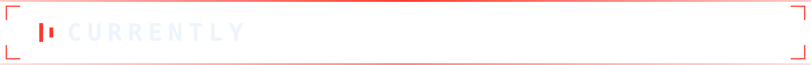
</picture>

**Software Engineer at [TIIX](https://github.com/AM-TIIX)** — a health and services
platform ([tiix.com.br](https://tiix.com.br/)). I work on the PHP portals for
clients, professionals and brokers: registration and permission flows, scheduling,
payments, and the shared foundation beneath them. Legacy PHP in a WordPress-based
ecosystem, with reversible MySQL migrations.

<picture>
  <source media="(max-width: 700px) and (prefers-color-scheme: dark)" srcset="./assets/h-stack-m.svg">
  <source media="(max-width: 700px) and (prefers-color-scheme: light)" srcset="./assets/h-stack-m-light.svg">
  <source media="(prefers-color-scheme: dark)" srcset="./assets/h-stack.svg">
  <source media="(prefers-color-scheme: light)" srcset="./assets/h-stack-light.svg">
  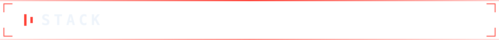
</picture>
<picture>
  <source media="(prefers-color-scheme: dark)" srcset="./assets/stack.svg">
  <source media="(prefers-color-scheme: light)" srcset="./assets/stack-light.svg">
  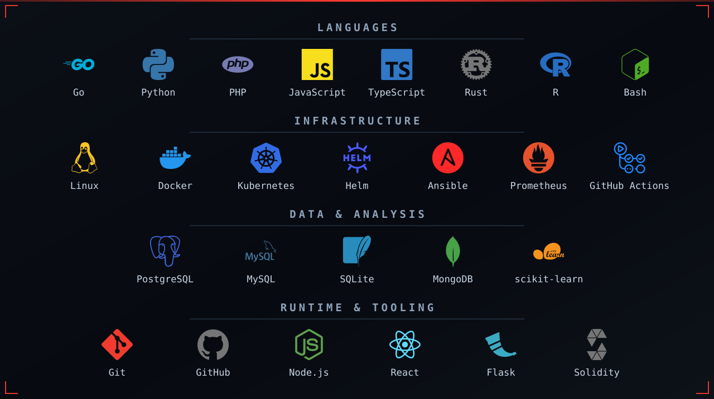
</picture>

<picture>
  <source media="(max-width: 700px) and (prefers-color-scheme: dark)" srcset="./assets/h-communities-m.svg">
  <source media="(max-width: 700px) and (prefers-color-scheme: light)" srcset="./assets/h-communities-m-light.svg">
  <source media="(prefers-color-scheme: dark)" srcset="./assets/h-communities.svg">
  <source media="(prefers-color-scheme: light)" srcset="./assets/h-communities-light.svg">
  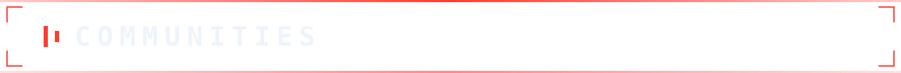
</picture>

<a href="https://github.com/QuantConnect"><picture>
  <source media="(max-width: 700px) and (prefers-color-scheme: dark)" srcset="./assets/c-qc-m.svg">
  <source media="(max-width: 700px) and (prefers-color-scheme: light)" srcset="./assets/c-qc-m-light.svg">
  <source media="(prefers-color-scheme: dark)" srcset="./assets/c-qc.svg">
  <source media="(prefers-color-scheme: light)" srcset="./assets/c-qc-light.svg">
  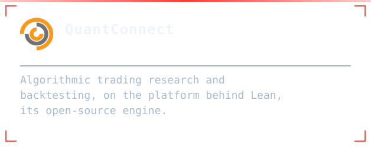
</picture></a>
<a href="https://github.com/AM-TIIX"><picture>
  <source media="(max-width: 700px) and (prefers-color-scheme: dark)" srcset="./assets/c-tiix-m.svg">
  <source media="(max-width: 700px) and (prefers-color-scheme: light)" srcset="./assets/c-tiix-m-light.svg">
  <source media="(prefers-color-scheme: dark)" srcset="./assets/c-tiix.svg">
  <source media="(prefers-color-scheme: light)" srcset="./assets/c-tiix-light.svg">
  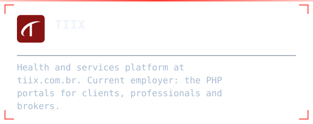
</picture></a>
<a href="https://github.com/NER-ELOHIM"><picture>
  <source media="(max-width: 700px) and (prefers-color-scheme: dark)" srcset="./assets/c-ner-m.svg">
  <source media="(max-width: 700px) and (prefers-color-scheme: light)" srcset="./assets/c-ner-m-light.svg">
  <source media="(prefers-color-scheme: dark)" srcset="./assets/c-ner.svg">
  <source media="(prefers-color-scheme: light)" srcset="./assets/c-ner-light.svg">
  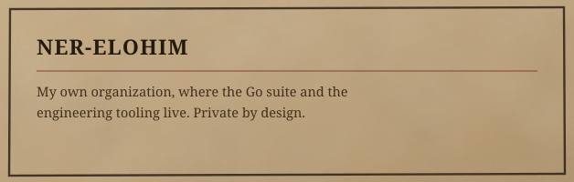
</picture></a>
<a href="https://github.com/instituto-nova-sos"><picture>
  <source media="(max-width: 700px) and (prefers-color-scheme: dark)" srcset="./assets/c-sos-m.svg">
  <source media="(max-width: 700px) and (prefers-color-scheme: light)" srcset="./assets/c-sos-m-light.svg">
  <source media="(prefers-color-scheme: dark)" srcset="./assets/c-sos.svg">
  <source media="(prefers-color-scheme: light)" srcset="./assets/c-sos-light.svg">
  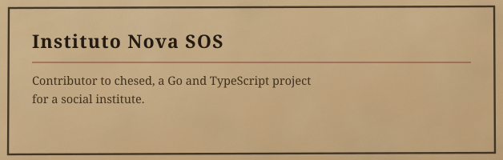
</picture></a>

<picture>
  <source media="(max-width: 700px) and (prefers-color-scheme: dark)" srcset="./assets/h-contact-m.svg">
  <source media="(max-width: 700px) and (prefers-color-scheme: light)" srcset="./assets/h-contact-m-light.svg">
  <source media="(prefers-color-scheme: dark)" srcset="./assets/h-contact.svg">
  <source media="(prefers-color-scheme: light)" srcset="./assets/h-contact-light.svg">
  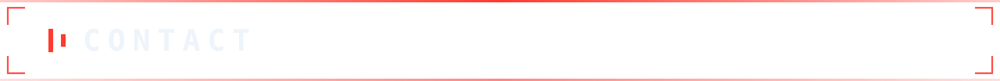
</picture>

  Open to <b>remote roles and contract work</b>: backend engineering,
  quantitative development and data automation.

  
  

